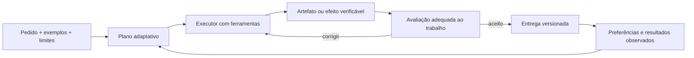

# Squad: revisão técnica e proposta de evolução

Data: 24/09/2026. Perfil: framework. Revisão Git: `3b31b94bfe6c008f303af3f2800c5b0c9a266d7d`, com as alterações locais da revisão anterior preservadas. Node v24.19.0, Windows x64.

## Parecer

O Squad tem componentes valiosos para se tornar uma unidade de trabalho reutilizável: domínio, executores, ferramentas, memória, entregáveis, avaliação e distribuição. O principal limite encontrado é a ligação entre esses componentes. A camada de autoria é mais elaborada que algumas garantias do runtime.

A recomendação é consolidar primeiro a execução e a comprovação de resultado; depois oferecer uma experiência simples de pedir, acompanhar, revisar e reutilizar entregas. Modelos mais capazes podem escolher melhor o caminho e produzir trabalhos melhores, mas não corrigem uma gravação concorrente perdida nem tornam um evento confirmado antes da entrega confiável.

Esta rodada é uma análise solicitada pelo operador. Foram produzidos este relatório e sondas isoladas, sem alterar código de produção, agentes ou contratos do Squad. Não houve chamadas pagas a modelos, publicação, envio de mensagens ou alteração de projetos consumidores.

## Escopo e evidências

Inspecionados: kernel `@squad`; skill router e módulos de criação, pacote, conteúdo e sessão; tarefas de criação/revisão/perfil/decomposição; preflight; gerador de executores; scaffold e scripts de workers; autorun; decomposição; adapter Agent Teams; pipeline; daemon; reflexão; verificação; eval; aprendizagem; persistência de plano; saída; recuperação e indicadores.

Inventário do CLI: 40 identificadores únicos `squad:*` no registro, incluindo alias e comandos comerciais. Não equivale a 40 experiências diferentes nem inclui todos os subcomandos. A revisão do CLI foi concentrada nos caminhos de squads, não em todos os comandos do AIOSON.

| Medição | Resultado | Evidência |
|---|---|---|
| Contrato do projeto | pass | `aioson context:validate . --json` |
| Testes existentes da superfície de squads | pass | 51 arquivos, 563 testes, zero falhas/skips, 13,92 s; `../runtime/squad-review-tests.log` |
| Sondas de fronteiras entre componentes | defeitos confirmados | `../runtime/squad-review-probes.json` |
| Script reproduzível das sondas | executado | `node .aioson/runtime/squad-review-probe.cjs`; fixtures temporárias removidas ao final |
| Auditoria estática geral | reutilizada da revisão anterior | `../runtime/quality/audit.json`; não repetida sem alteração de código |
| Ensaios reais de conteúdo, processos externos e construção com modelos | not_run | testes e sondas determinísticos não medem excelência de entregas de IA |
| Uso real de clientes nesta rodada | not_run | nenhum projeto consumidor foi acessado |

## O que já existe e merece ser preservado

- Pacote canônico portátil em `.aioson/squads/{slug}`, com arquivos como fonte dos entregáveis e SQLite como índice local.
- Reutilização de executores e distinção entre núcleo persistente e especialista temporário.
- Workers determinísticos, pesquisa, skills e integração com ferramentas externas.
- Avaliação com fontes, tarefas reservadas, hashes de evidências e comparação controlada de genomes. O `eval-engine` exige avaliador separado para notas numéricas: é mais rigoroso que a reflexão genérica e deve ser reaproveitado.
- Contexto sob demanda, medição de tamanho, detecção de duplicação e recuperação de sessão.
- Histórico de tentativas, heartbeat, estados e infraestrutura de eventos.
- A correção anterior do transporte de payload por arquivo evita limites de argv em workers no Windows.

## Defeitos confirmados — corrigir antes de ampliar autonomia

### P0 — Atualizações paralelas perdem estado

**Local:** `src/squad/task-decomposer.js:584`, `updateTaskStatus` / `savePlan`; chamado em paralelo pelo autorun.

A atualização faz leitura, mutação e regravação do plano JSON completo, sem serialização da operação. A sonda pediu 12 atualizações concorrentes de tarefas distintas: apenas uma ficou persistida, em duas execuções da sonda. O risco é repetir trabalho, perder evidência e retomar do ponto errado.

**Recomendação:** único escritor por sessão ou transação com revisão/compare-and-swap; gravação atômica protege a integridade do arquivo, mas sozinha não evita perda de atualização. A solução precisa cobrir concorrência entre processos, não apenas promises do mesmo processo. Manter exportação portátil do plano conforme a política file-first.

**Aceitação:** 12 atualizações concorrentes preservadas; interrupção durante gravação não corrompe o plano; retomada não reexecuta tarefa confirmada. Dono sugerido: Dev/runtime.

### P0 — Dependência falha, tarefa seguinte executa

**Local:** `src/commands/squad-autorun.js:1096`, seleção por `parallel_groups`.

A sonda executou uma tarefa upstream sem worker e uma downstream dependente dela. A primeira falhou; a segunda foi executada e concluída. O comando percorre grupos e filtra tarefas pendentes sem usar o veredito atual das dependências para liberar cada tarefa. Existe `getReadyTasks`, mas esse caminho não o usa.

**Recomendação:** liberar apenas tarefas cujas dependências estejam confirmadas; representar bloqueio com causa e preservar a tarefa para retomada. Validar ciclos/IDs do plano recebido antes de executar.

**Aceitação:** falha upstream impede o efeito downstream, causa fica visível e a correção libera somente o restante. Dono: Dev/runtime.

### P0 — Revisão pede correção, autorun marca concluído

**Local:** `src/commands/squad-autorun.js:303`, decisão de `finalStatus`.

Com `--reflect`, uma saída curta recebeu `NEEDS_ITERATION`, nota 0,6, e foi persistida como `completed`, com `ok: true`. O autorun distingue falha do worker e `ESCALATE`; os demais vereditos caem em concluído.

**Recomendação:** mapear todos os vereditos explicitamente. `NEEDS_ITERATION` retorna à correção; revisão crítica pendente permanece não verificada; aprovação exige evidência aplicável.

**Aceitação:** teste de integração produz esse veredito e confirma ausência de `completed_at` até uma revisão aprovada. Dono: Dev/runtime e avaliação.

### P0 — Handoff é consumido mesmo com falha do worker

**Local:** `src/squad-daemon.js:349`, `_pollEvents`.

O loop aguarda o worker, mas não inspeciona seu resultado antes de marcar o evento consumido. Em uma sonda com banco e executor simulados, o executor devolveu `{ok:false}` e a confirmação de consumo ocorreu. A sonda comprova o fluxo de controle; não foi um ensaio com serviço externo real.

**Recomendação:** reclamar evento de forma atômica, confirmar somente a conclusão e guardar falha/tentativas para retomada. Para efeitos externos, adotar chave de idempotência ou reconciliação; não prometer “exactly once” apenas com flags locais.

**Aceitação:** entrega falha permanece recuperável; polling concorrente não duplica a mesma entrega; reinício mantém rastreabilidade. Dono: Dev/processos.

### P1 — Critérios canônicos podem ser ignorados e critérios críticos não avaliados recebem aprovação

**Local:** `src/squad/reflection.js:44`, `:53`, `:194`, `:233`.

O carregador lê `squad.json` e `quality.md` na raiz do pacote. O pacote atual usa `squad.manifest.json` e `checklists/quality.md`. A sonda escreveu um critério crítico nos caminhos atuais e recebeu a checklist genérica. Outra sonda passou o critério diretamente: ele apareceu em `needs_llm_review`, mas o resultado foi `DONE`, `passed:true`, nota 1.

Além disso, `on_topic` testa tamanho de texto, não pertinência; `actionable` testa quantidade de palavras. Esses sinais são úteis como lint, mas não sustentam uma avaliação de mérito.

**Recomendação:** resolver o contrato canônico com fallback explícito para legado; separar lint, critérios determinísticos, julgamento semântico e revisão humana. Uma dimensão crítica não avaliada fica `UNVERIFIED`. Reaproveitar as fronteiras do `eval-engine` em vez de criar mais uma nota paralela.

**Aceitação:** critérios específicos entram no relatório; um critério crítico sem avaliador não aprova. Dono: Dev/avaliação.

### P1 — Orçamento interrompe tudo e resumo ainda sinaliza sucesso

**Local:** `src/commands/squad-autorun.js:1114`, `:1259`.

Com limite de um token, a execução realizou zero de uma tarefa, marcou a tarefa `skipped` e devolveu `ok:true`. Uma pausa torna-se indistinguível de tarefa dispensada; a retomada filtra `pending`.

O orçamento atual usa descrição/AC divididos por quatro mais overhead fixo; não incorpora fielmente tokens do modelo, todas as repetições e todos os contextos. `maxTokensPerTask` é carregado mas não cobrado pelo loop legado.

**Recomendação:** `paused_budget`, tarefas retomáveis, resultado parcial explícito e uso real do provider quando disponível. Estimativa deve continuar rotulada como estimativa. Um limite rígido só pode ser prometido se o adapter conseguir aplicá-lo.

**Aceitação:** pausa não relata conclusão e retoma as tarefas restantes sem repetir as anteriores. Dono: Dev/runtime.

### P1 — Worker recém-gerado pode parecer entrega pronta

**Local:** `src/worker-runner.js:655`, `generateRunJs`; `hasExecutionEvidence` no autorun.

O scaffold gera TODO e, sem campos de saída, devolve `{result:"ok"}`. Uma sonda gerou esse worker e o autorun marcou sua tarefa como concluída. Isso não significa que `squad:validate --strict` aprovaria o pacote; demonstra que o caminho de execução não garante essa precondição.

**Recomendação:** stub explicitamente não executável/não implementado; readiness verificado na entrada pública; conclusão vinculada a artefato ou mudança observável conforme o tipo da tarefa.

**Aceitação:** scaffold intacto nunca conta como entrega realizada. Dono: Dev/geração de workers.

### P1 — Subcomandos declarados não têm operação correspondente no preflight

**Local:** `.aioson/agents/squad.md`, roteamento; `src/lib/squad-preflight.js:21`.

O kernel oferece `review`, `profile`, `learning-review`, `task-decompose` e `pipeline`, mas todos devolvem `invalid_operation` no resolvedor. É possível o agente inferir outra operação, porém não há mapeamento explícito que cumpra a exigência de um preflight determinístico.

**Recomendação:** registro único de operação → tarefa → módulos → ferramenta; aliases explícitos e teste de cobertura do mapa. Dono: Dev/kernel.

## Limites e oportunidades confirmados por inspeção

### A inteligência do plano ainda depende de um passo externo

`decompose(mode:structured)` gera as mesmas tarefas heurísticas do modo comum e acrescenta um prompt. O comando salva esse prompt e pede que um agente o preencha antes de retomar. A sonda confirmou igualdade das tarefas. É preparação assistida, não planejamento semântico já executado.

No caminho Agent Teams, o autorun gera `team.json`, registra fim de sessão e retorna a orientação de ativação; não despacha e aguarda os executores nesse trecho. O pipeline também declara modo guiado. Essas capacidades têm utilidade, mas a experiência precisa distinguir `prepared`, `running`, `awaiting_review` e `completed`.

### Três fontes de progresso para trabalhos relacionados

O plano de rodadas (`docs/execution-plan.md` mais SQLite), o plano de autorun (`sessions/{id}/plan.json`) e o pipeline de handoffs possuem representações próprias. Recomendo uma identidade de execução e um contrato de status comum, com projeções para cada visão. Não é necessário substituir todos os armazenamentos em uma refatoração única.

### A ativação Quick continua pesada

Preflight medido em `default-create`, `mode:content`, sinais `content,new-domain`:

| Lane | Arquivos selecionados | Bytes | Estimativa do CLI |
|---|---:|---:|---:|
| Quick | 13 | 102.093 | 25.523 tokens |
| Standard | 16 | 116.961 | 29.240 tokens |
| Premium | 16 | 116.961 | 29.240 tokens |

São tamanhos dos arquivos indicados, incluindo kernel, tarefas e módulos; não tokens faturados nem contexto efetivamente lido. Referências adicionais abertas pela skill podem aumentar o total. Standard/Premium selecionarem os mesmos arquivos não significa que executem o mesmo nível de avaliação.

Carregar design, create e validate juntos antecipa instruções de etapas futuras. Proposta: um núcleo curto, contrato compilado do pacote e módulos carregados na fase em que serão usados. Quick deve reduzir a preparação sem diluir os controles necessários aos efeitos executados.

### Personalidade e cerimônia precisam demonstrar utilidade

`creation-flow.md` recomenda 3–5 papéis, perfis comportamentais e ao menos dois frameworks por executor não trivial. `session-operations.md` orienta apresentar especialistas em sequência e perguntar qual aprofundar. Isso serve para consultoria colaborativa, mas cria trabalho desnecessário em uma solicitação direta de produção.

Proposta: um executor por padrão, especialização temporária quando houver diferença real de contexto/ferramenta/competência e revisão independente proporcional ao risco. Persona/backstory/DISC e genomes entram quando exemplos e avaliações demonstrarem melhoria de voz ou método. Conhecimento, restrições e exemplos aprovados continuam preservados.

### HTML de sessão é uma visualização, não toda entrega

`content-output.md` manda gerar HTML com blocos por especialista, tema técnico escuro, Tailwind e Alpine CDN após toda rodada produtiva. O contrato é útil como visualização, mas não corresponde igualmente a um CSV operacional, um vídeo, código ou uma peça pronta para publicação.

Proposta: artefato canônico por tipo de entrega e renderer reutilizável para visualizar seu índice e histórico. O modelo produz o conteúdo e a estrutura; o sistema gera a apresentação repetitiva. Atualizar `latest` apenas quando houver nova versão material.

### Votação não comprova consenso sobre conteúdo

`synthesizeVotes` em `squad-autorun.js:621` conta estados finais e escolhe a primeira saída com estado vencedor. Duas respostas contraditórias com `completed` concordam nessa métrica. Não a usar como aceitação de decisão crítica. Reservar múltiplas alternativas para divergência útil, avaliadas por critérios explícitos.

### Aprendizagem perde sinais de fracasso

O autorun passa a `extractLearnings` somente resultados concluídos. O extrator tem ramos para artefatos ausentes e tarefas escaladas; esses ramos não recebem tais resultados nessa chamada. Manter sucessos e falhas com provenance, sem promover automaticamente inferências a regras permanentes.

## Experiência proposta para os três usos

| Uso | Pedido do usuário | Experiência desejada | Prova de entrega |
|---|---|---|---|
| Conteúdo | “Prepare a campanha da semana usando estas fontes e minha voz” | pauta, alternativas de direção quando úteis, peças vinculadas às fontes, prévia, correção por trecho e adaptação entre formatos | peças existentes, afirmações apoiadas, cobertura do briefing, aprovação e histórico de revisão |
| Processos | “Trate estes pedidos e encaminhe as exceções” | evento ou lote entra, worker executa o determinístico, IA decide apenas a ambiguidade, revisão recebe exceções | registros alterados, recibos, reconciliação, ausência de repetição de efeitos e retomada |
| Construção | “Construa este painel/automação/apresentação” | examina o existente, define saída verificável, usa ferramentas reais, entrega uma versão utilizável e corrige a partir do feedback | arquivo/app acessível, funcionamento pelo ponto de entrada real, validação apropriada ao artefato |

### Uma superfície pequena para o cliente

Proposta de comandos novos, **ainda não implementados**:

```text
aioson squad run <slug> --goal="..."
aioson squad status <run-id>
aioson squad resume <run-id>
aioson squad revise <run-id> --feedback="..."
```

Criação, configuração, inspeção e catálogo ficam agrupados no help conforme a intenção. Os comandos `squad:*` atuais permanecem compatíveis durante a migração; o cliente não precisa aprender 40 identificadores para produzir sua primeira entrega.

O fluxo natural por chat deve chamar a mesma implementação que CLI e UI. O pedido de revisão altera o artefato e somente os derivados afetados. O status mostra entrega atual, motivo de bloqueio, próxima ação e consumo conhecido, com distinção entre medido e estimado.

### Um contrato comum por execução



Cada execução define resultado, entradas, efeitos permitidos, recursos disponíveis, evidências esperadas e condição de parada. O plano pode mudar conforme descobertas, preservando objetivo e limites. O cliente decide apenas ambiguidades ou ações que realmente exigem sua escolha.

## Melhorias com maior potencial de diferenciação

1. **Revisão localizada com dependências.** “Mantenha o argumento, encurte a abertura e atualize apenas os posts derivados.” Versionar a entrega, localizar a alteração e recalcular só os derivados afetados. Reaproveita os blueprints e relações já existentes.
2. **Memória de exemplos aprovados.** Guardar antes/depois, motivo de aprovação, domínio e validade. Recuperar poucos exemplos pertinentes em vez de injetar toda a persona e todos os aprendizados em cada tarefa.
3. **Autonomia proporcional.** Resolver tarefas simples diretamente; abrir especialistas somente quando puderem contribuir separadamente. Modelo forte decide o plano; scripts fazem transformações e verificações determinísticas. Escolher provider/modelo por tarefa e evidência disponível, não por um ranking fixo.
4. **Contrato de entrega por domínio.** Conteúdo avalia voz, evidência e utilidade; processo avalia efeitos e exceções; construção avalia comportamento real. Uma única nota de “qualidade” não substitui essas provas.
5. **Prévia antes de expandir o lote.** Uma peça ou vertical representativa confirma direção; depois o squad amplia mantendo o padrão aprovado. Reutiliza pilot/blueprints sem impor o mesmo ritual a todo domínio.
6. **Catálogo que informa o que o squad consegue executar agora.** Expor entradas, saídas, ferramentas disponíveis, integrações faltantes, exemplo aprovado e última avaliação. Uma descrição atraente do pacote não deve implicar readiness operacional.
7. **Custo por entrega aceita.** Combinar consumo medido, tentativas, revisões humanas e aceitação. `squad:roi` já armazena métricas; evoluir os dados de execução antes de apresentar economia como fato.

## O que simplificar, manter opcional e evitar

- Simplificar: leituras antecipadas, repetição de contrato, apresentação de cada especialista em trabalho direto, HTML reescrito pelo modelo e múltiplas representações de status sem ligação.
- Tornar opcional: mínimo de papéis, perfis comportamentais, backstory, investigação para domínio trivial já documentado, genomes sem ganho demonstrado e votação repetitiva.
- Preservar: fontes e exemplos do cliente, portabilidade, controle de efeitos, avaliação independente quando necessária, recuperação, evidência de conclusão e compatibilidade histórica.
- Evitar: outro framework de orquestração paralelo, geração automática de mais agentes, pontuação baseada só em comprimento, autoconfirmação de entrega e corte de funcionalidades de clientes sem dados de uso.

## Sequência recomendada e critérios de aceitação

| Etapa | Trabalho | Critério de saída |
|---|---|---|
| 1 — Confiabilidade | persistência concorrente, dependências, vereditos, pause/resume, confirmação de eventos e stubs | todas as reproduções deste relatório viram regressões verdes; efeitos não são duplicados nas falhas ensaiadas |
| 2 — Execução coerente | identidade/status comum, adapter que realmente executa, planejamento estruturado validado e entrada simples | um caso de conteúdo, um de processo e um de construção concluem e retomam pelo caminho público |
| 3 — Utilidade percebida | revisão localizada, exemplos aprovados, renderer de entregas e qualidade por domínio | clientes conseguem corrigir uma entrega sem recriar todo o trabalho; evidência de menor retrabalho |
| 4 — Otimização medida | carregamento por fase, escolha adaptativa de executor/modelo e eliminação de etapas redundantes | comparação pareada no mesmo corpus, preservando ou melhorando aceitação e medindo tempo/custo reais |

Sugestão de corpus inicial: seis tarefas de conteúdo, seis de processo, seis de construção e casos de recuperação. Incluir material contraditório, fonte insuficiente, alteração de preferência, integração indisponível, falha upstream e reinício. Comparar um executor forte com a composição adaptativa sob os mesmos critérios; não atribuir superioridade ao arranjo mais complexo sem evidência.

## Relação com modelos atuais e fontes

A orientação de delegar quando há independência real, controlar contexto e avaliar resultados é consistente com a experiência publicada pela [Anthropic sobre multiagentes](https://www.anthropic.com/engineering/multi-agent-research-system). As medições desse artigo pertencem ao sistema deles e não foram extrapoladas para o AIOSON.

Ferramentas com funções claras e menor sobreposição seguem a orientação de [projeto de ferramentas para agentes](https://www.anthropic.com/engineering/writing-tools-for-agents). Separar provas determinísticas, julgamento semântico e feedback humano é compatível com [avaliações de agentes](https://www.anthropic.com/engineering/demystifying-evals-for-ai-agents).

Esta revisão não comparou os modelos comerciais mais recentes nem determinou um vencedor. A arquitetura recomendada permite trocar e avaliar modelos sem reescrever os contratos do produto. O diferencial do Squad deve aparecer em entregas aceitas, continuidade e personalização verificável.

**Próximo responsável recomendado:** Dev, começando pelas fronteiras de execução da etapa 1. Os defeitos têm reproduções locais; a experiência proposta nas etapas seguintes ainda exige desenho e validação de produto.
